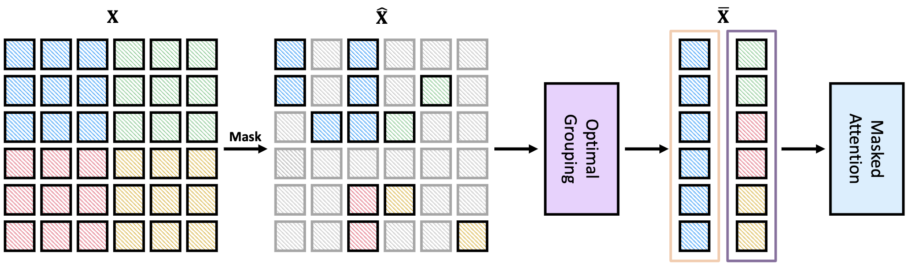
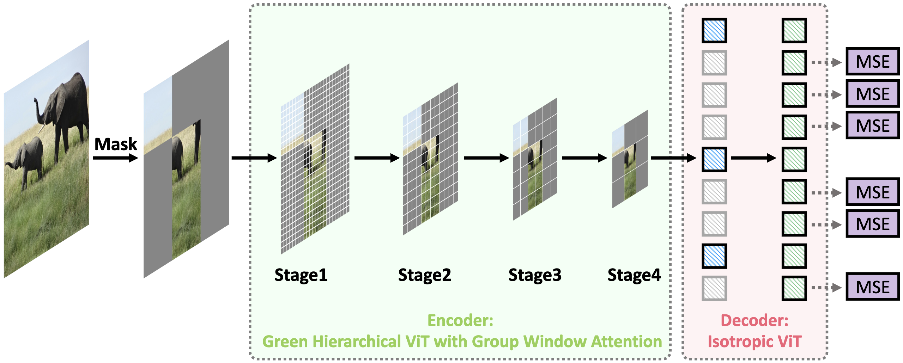

# GreenMIM

This is the official PyTorch implementation of the paper [Green Hierarchical Vision Transformer for Masked Image Modeling](https://arxiv.org/abs/2205.13515).

<p align="center">
  
</p>
<p align="center">
  Group Attention Scheme.
</p>

<p align="center">
  
</p>
<p align="center">
  Method Overview.
</p>

## Citation
If you find our work interesting or use our code/models, please cite:

```bibtex
@article{huang2022green,
  title={Green Hierarchical Vision Transformer for Masked Image Modeling},
  author={Huang, Lang and You, Shan and Zheng, Mingkai and Wang, Fei and Qian, Chen and Yamasaki, Toshihiko},
  journal={arXiv preprint arXiv:2205.13515},
  year={2022}
}
```

## Catalogs

- [x] Pre-trained checkpoints
- [x] Pre-training code
- [ ] Fine-tuning code

## Pre-trained Models

<table><tbody>
<!-- START TABLE -->
<!-- TABLE HEADER -->
<th valign="bottom"></th>
<th valign="bottom">Swin-Base (Window 7x7)</th>
<th valign="bottom">Swin-Base (Window 14x14)</th>
<th valign="bottom">Swin-Large (Window 14x14)</th>
<!-- TABLE BODY -->
<tr><td align="left">pre-trained checkpoint</td>
<td align="center"><a href="https://drive.google.com/file/d/1vCt7QN3rNC7hmWlWYomqfhjUqN-PvR7a/view?usp=sharing">Download</a></td>
<td align="center"><a href="https://drive.google.com/file/d/1P1dAdcZtSEGWFQy5GeeJdfGTqesSAES9/view?usp=sharing">Download</a></td>
<td align="center"><a href="https://drive.google.com/file/d/1Tw1KeGviVWxbVt3h1TT7BxTX1aLeT-Nm/view?usp=sharing">Download</a></td>

</tbody></table>

## Pre-training

The pre-training scripts for slurm users are given in the `scripts/` folder.

To train a Swin-B with on a single node with 8 GPUs:

```bash
bash scripts/run_mae_swin_base.sh [Partition] [NUM_GPUS] 
```

Instructions for non-slurm users will be available soon.

## Fine-tuning

| Model | #Params | Pre-train Resolution | Fine-tune Resolution | Acc@1 (%) |
| :---- | ------- | -------------------- | -------------------- | ------------ |
| Swin-B (Window 7x7) | 88M | 224x224 | 224x224 | 83.7 |
| Swin-L (Window 14x14) | 197M | 224x224 | 224x224 | 85.1 |

The code will be available soon.


# Acknowledgement
This code is based on the implementations of [MAE](https://github.com/facebookresearch/mae), [BEiT](https://github.com/microsoft/unilm/tree/master/beit), [SwinTransformer](https://github.com/microsoft/Swin-Transformer), and [DeiT](https://github.com/facebookresearch/deit).

## License

This project is under the CC-BY-NC 4.0 license. See [LICENSE](LICENSE) for details.
